# 近期总结

目前我的工作主要分为两个：
1. 自己从头到尾，训练并改进baseline模型-A,使用最常见的方法，期望达到现阶段人体姿态估计的the state of art

2. 尝试使用Ensemble、boosting、metalearning的方法以及人体mask信息，期望能够使用一个额外的模型B，使得A+B>=A

## 关于如何A+B>=A?

当前一般的人体姿态估计的解决步骤大致可以由：`拟合`和`推理`，两部分构成


拟合：
1.坐标回归：数值坐标的回归，这样的方法训练起来较为困难，性能一般不高
2.heatmap回归：根据gt坐标生成heatmap监督，输出关键点位置置信度信息的heatmap

推理：
1. 自下而上中，推理包括两个，从heatmap中找到候选关键点位置，然后从多个候选点中推理出不同人体
2. 自上而下中，因为只进行单人姿态估计，推理部分一般意味着，找取heatmap中最大值的位置

而以上的`拟合-推理`方法，会容易忽略一个重要的细节:比如，以heatmap回归为代表的主流方法中，会默认heatmap最大值位置或者最高锋到次高峰一定偏量的位置作为候选关键点位置，但在难以检测的困难关键点上，keypoint位置不确定度很高，数值分布不均匀，尖峰值很低，最大值位置不能直接作为参考依据！

直接取最大值相当于忽略了heatmap中的大量信息！

## 实验
我做了大量的对比实验，用两个baseline模型（`A: mAP=0.72`, `B: mAP=0.7` ），观察实际的实验结果，可以看出：

### 简单样本的一个例子

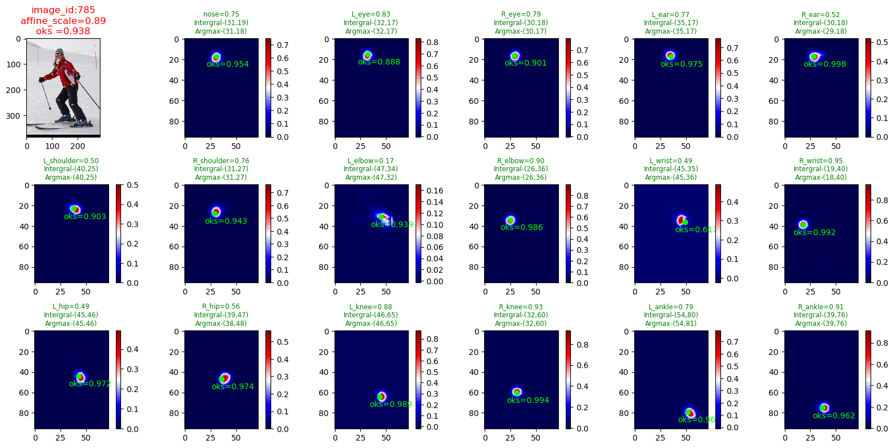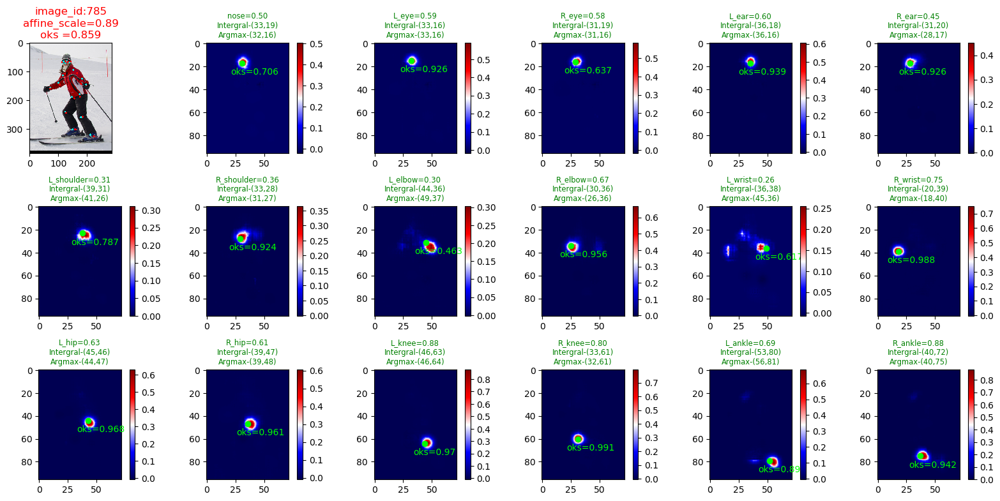
### 困难样本
44877
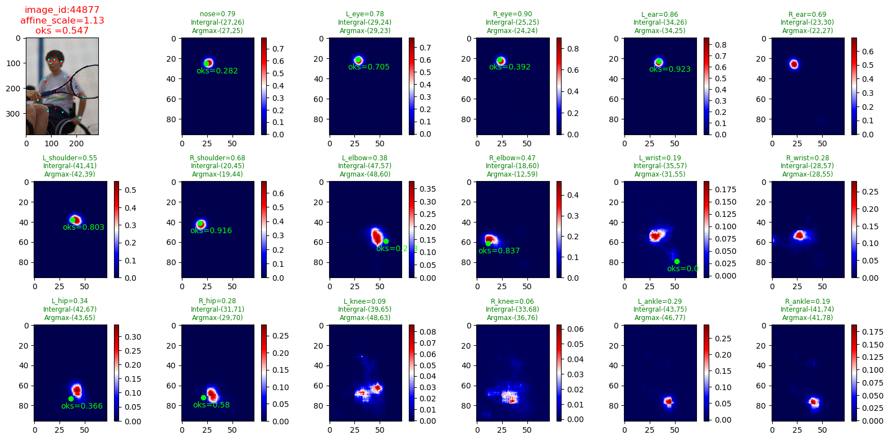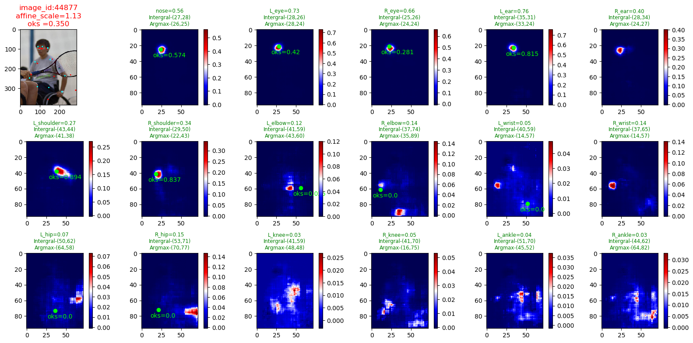

350122
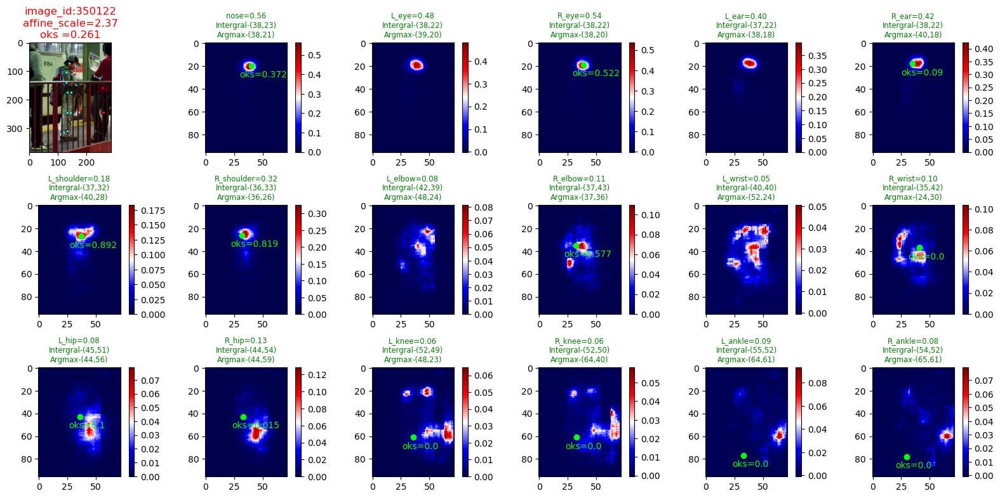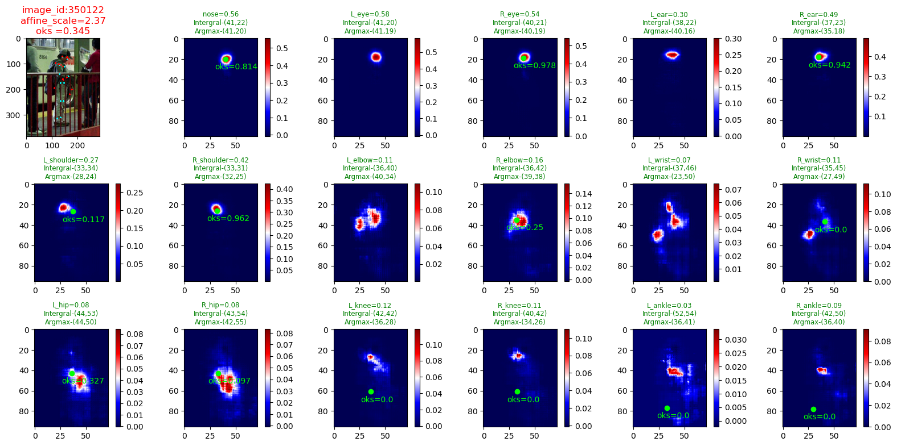
1. 在面对容易检测样本或关键点上，A和B产生的heatmap peak分布近乎一致，呈现较为标准的尖峰高斯分布！
2. 在面对容易检测的关键点上，heatmap最大值的取值较高，A和B中可能会有一个更接近GT的位置，B的个别关键点预测可能会比A好，但整体不如A

3. 在面对难以检测的关键点，heatmap的预测并没有呈现标准的高斯峰，即：其数值分布不均匀，最大值的取值也很小
4. 在面对很难检测的关键点上，A和B产生的Heatmap 不一致，尖峰位置的更加随机性，往往和GT产生较大偏差
5. 在面对很难检测的关键点上，heatmap的取值较低，最高峰点不能直接作为与groundtruth的最近点
6. 在面对很难检测的关键点上，我们必须考虑heatmap的分布，比如次高峰集中的区域的可能性
7. 在面对很难检测的关键点上，一个模型的输出的会产生偶然性，我们要从两个模型的输出中，发掘一些必然性（然而实际情况简单的AB组合，难以从两个模型在困难关键点上的偶然性种发现必然性，因为模型容易犯相同的错误！）
8. 在面对很难检测的关键点上，即使我们不知道真实的位置在哪里，但是heatmap上的分布要求我们需要针对这个点进行特殊处理
9. 相同关节的左右位置必须存在抑制的权重，否则容易引起误检
10. A和B的功能不能太相似，它们必须有侧重


以上可以总结为：
heatmap是模型对于图像的理解，可以视为人体关键点信息的`metadata`原始数据，不仅包含了位置信息，也包含了模型对判断的认知，而直接取最大值位置会忽略有用的信息！


跟据上面的论述我的起初设计是一个`combinetworks`:

``` python

class Combinetworks(nn.Module):
    '''
    Learning to combine two low-confidence keypoints heatmaps to be more accurate by gradient descent 
    Use hypernetworks to predict the weight-parameters of the Convolution filter.

    The weight denotes the meta-combination weight of two low-confidence heatmaps, which means
    two model are uncertain about this keypoint position and two peak positions of heatmaps may be 


    Args :
        `feature_channels`:   the number of combine_feature_channels
        `feature_h`       :   the height of combine_feature_map
        `feature_w`       :   the width  of combine_feature_map
        `heatmap_channels`:   the number of combine_heatmap_channels
        `activation`      :   activation for propress

    Input: `combine heatmaps`: [N,keypoints_channel*model_num,h1,w1]
           `combine features`: [N,featuremap_channels*model_num,h2,w2]
    
    Output: `meta_heatmaps` : [N,keypoints_channel,h1,w1]

    note:  heatmaps combine -> meta-heatmap  [17*2,h,w]-> [17,h,w]
        
        `combination_conv` parameters respresent the meta-weight, which means how to combine two heatmaps to get a better results
        but in forward computing, we use the `torch.nn.functional.conv2d` instead of `torch.nn.Conv2d`, because we need to use
        the predicted weights to compute the convolution operation to generate the computing graph

        we use the `hypernetworks` to predicting weights

     '''

    def __init__(self, feature_channels, feature_h, feature_w, heatmap_channels, activation='relu'):
        super().__init__()
      
        self.AtrousRate = 6 # enlarge the receptive field to cover heatmap gaussian kernel
        self.kernel_size = 5 
        self.padding = int(self.AtrousRate*(self.kernel_size-1)/2) # keep heatmap size
        
        self.combination_conv = nn.Conv2d(heatmap_channels,    17,     kernel_size = self.kernel_size,
                                                                dilation = self.AtrousRate,
                                                                padding = self.padding,
                                                                stride = 1,
                                                                bias=False)  # combination does not need bias

        conv_filter_param_num = torch.numel(self.combination_conv.weight.data)

        ################### predicting weight networks  ################
        ###### reduce the dimension of input featuremap channels
        self.activation = nn.ModuleDict([
                                        ['sigmoid', nn.Sigmoid()],
                                        ['relu', nn.ReLU()]  
                                        ])
    
        self.preprocess_feature  = nn.Sequential(

                        nn.Conv2d(feature_channels,1024,   kernel_size = 3, padding=1, stride=1),
                        nn.BatchNorm2d(1024),
                        self.activation['relu'],
                        nn.Conv2d(1024,512,kernel_size=1),
                        nn.BatchNorm2d(512),
                        self.activation['relu'])

        ###################  hypernetworks two-layers linear network  ###########       
        self.hypernetworks = nn.Sequential(
            nn.Linear(   512*feature_h*feature_w,  2048,   bias=True),
            nn.Linear(   2048,  conv_filter_param_num ,bias=True)
             )
        ################################################################

    def forward(self, feature_maps , heatmaps):

        # propress
        feature_embedding = self.preprocess_feature(feature_maps)
        feature_embedding = feature_embedding.view(feature_embedding.size()[0],-1)

        # hpyernetworks
        predict_weights = self.hypernetworks(feature_embedding)

        weight_shape = self.combination_conv.weight.data.size()
        predict_weights = predict_weights.mean(dim=0) # average on the mini-batch
       

        Conv_Kernel_parameters  = predict_weights.view(weight_shape).clone()

        meta_heatmap = nn.functional.conv2d(heatmaps, Conv_Kernel_parameters,   dilation = self.AtrousRate,
                                                                                padding = self.padding,
                                                                                stride = 1,
                                                                                bias=None)
        return meta_heatmap

```
上述`combinetworks`的训练目标是：
$$loss=\frac{\left \| combinetworks(f_A,f_B,h_A,h_b)-h_{gt} \right \|_{2}^{2}}{\left \|h_A-h_{gt}  \right \|_{2}^{2}}$$

这种方法,我的combinet设计的并不好，原因：
1. 参数量巨大
2. A和B容易犯相同的错误
3. 从两个预测出来的两个heatmap的融合后，使用空洞卷积输出一个组合的结果，就破坏了A和B的输出知识，再学习这个combine卷积核太难了，并且是重复的

所以接下来，我应该是要利用学习好A和B的heatmaps，进行线性操作和偏置的操作，并且要有选择的，针对困难关键点，根据输入图像和先验信息，来推理。比如：

$meta = f(A,B) + c $  其中c为先验猜测

但是从上面的实验结果和分析，我认为A和B的模型必须有所区分，互补才能进一步精细，该如何做呢？

在很多实验结果中，可以发现，很多关键点的预测会落在很明显的人体区域外面，然而人会很直观地认为关键点一定会在人体的区域上，所以人体的mask信息是一个可以帮助精细关键点的重要信息，所以，我打算用B模型来试图预测一个mask区域,mask区域也可以被当作人的形状先验信息，然后使用一个组合策略来结合A和B的输出


$$coordiante = combine(A(x),mask(x)) ,B()\approx Mask() $$

这样的一个好处就是，我们并不需要精确的mask预测，也能用来提升关键点的预测,mask的主要作用在于提供位置先验，我们依然通过一个combinetworks来学习如何从`先验信息`与`关键点metadata信息`中，推理出更精确的位置。

我们`combinetwoks`的学习目标依然是：

$$loss=\frac{\left \| combinetworks(x,h_A(x),B_{mask}(x))-h_{gt} \right \|_{2}^{2}}{\left \|h_A(x)-h_{gt}  \right \|_{2}^{2}}$$

对于mask的预测，我暂时使用了一个ResNet-34的小网络B来预测，这个B的学习成本很低

下面是训练了20个周期，没有使用数据增强等(训练成本很低)的B模型的测试效果：

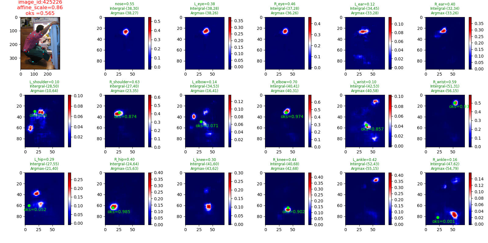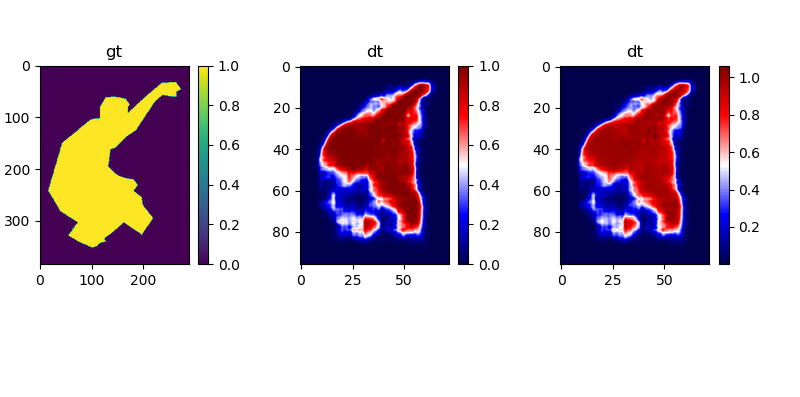

比如，这个人的右脚踝的关键点的heatmap`最大值(0.14)`和`Gt位置对应值(<0.05)`就很低，然而mask对应右脚踝区域的取值就比较高`>=0.5`,我们完全可以利用mask形状信息的高置信度，来判断右脚踝的位置。


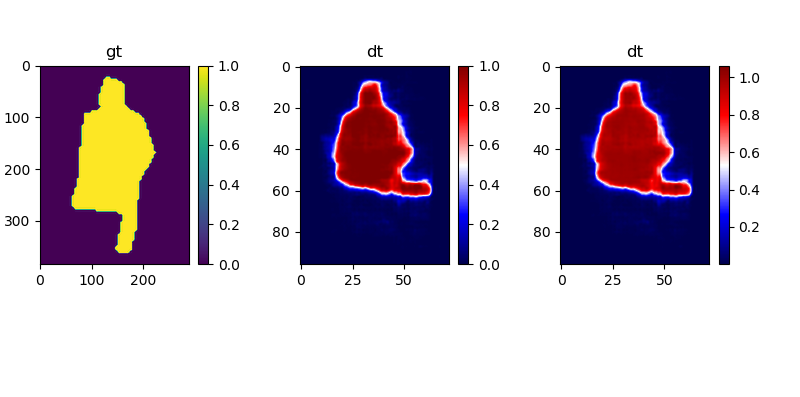

这个人的左臀部和右臀部恰好出在预测mask的下边缘上，其取值很高，然而，输出的keypoint对应位置的取值却很低。

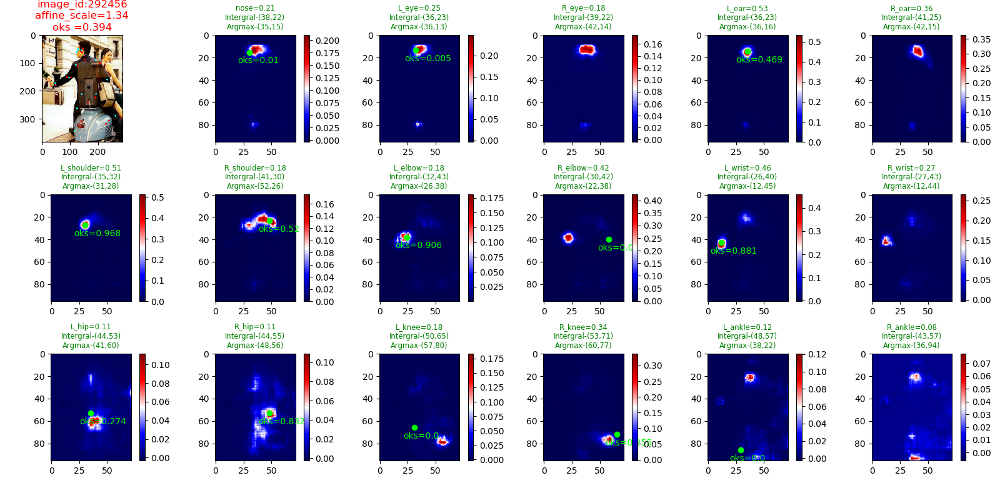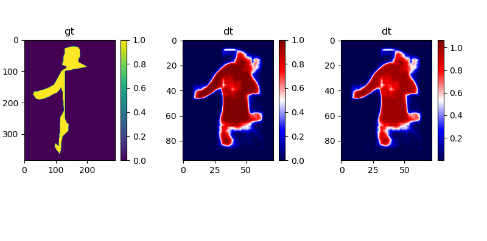
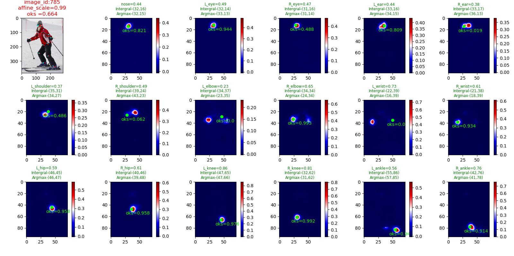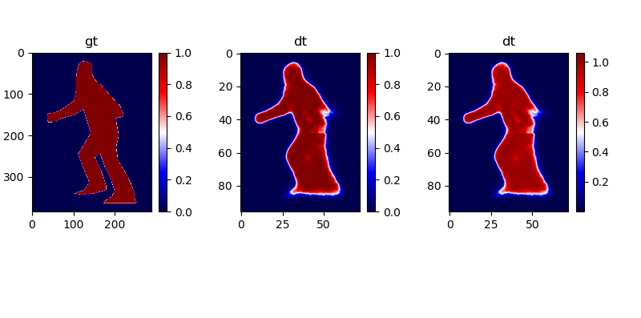
接下的工作，我需要重新设计combinet的结构，即如何结合A和B的输出，来得到更精准的关键点位置，值得说明一点，关于对样本难度的适应性，就是体现在combinet的学习中，即combinet的学习的知识或目标，是在差异化的样本图像特征、heatmap输出、mask信息中，学习组合的策略：(比如，keypoint输出低取值的heatmap, 那么keypoint位置应接受更多的mask信息的权重？)。

在 multi-pose net和MaskRcnn中，也试图将关键点回归和人体的mask分割任务做成多分支，共享卷积参数，而二者之间以隐含的网络权重，希望达到相互促进的作用，但是由于不可解释性，我们并不能直接断定mask是在帮助关键点回归，所有的参数学习都朝向更好的关键点拟合和mask拟合方向，而没有涉及到任何存在推理的部分。所以在这里，我不想用一个多任务的形式去拟合真实标签，而是希望，通过另一个结构，根据输出的mask和输出的关键点做进一步的关键点位置的推断。

在多任务学习中，keypoints heatmap与mask heatmap的关系隐含在网络的权重中，这个权重是根据目标函数的梯度下降来学习。而我们当前希望通过另一个结构，比如hypernetworks权重预测方法，来输出两者的组合权重获取更精确的keypoints heatmaps，这一结构的输入是keypoints heatmap与mask heatmap，这与多任务学习存在一个本质的区别：

**keypoints heatmap与mask heatmap的组合权重是根据keypoints heatmap与mask heatmap的取值（或者再加上图像或图像特征）来预测**

即我们希望，根据不同的keypoints heatmap和mask heatmap输出，发掘出一种适应性的策略来组合二者的信息，以让模型获取更完备的认知，虽然说这个组合权重也通过一个目标函数来学习，但是，它是一个独立的推理学习部分，而不单纯是一种拟合学习。

这种独立的结构也使得我们的组合权重预测可以应用到任何现有方法的baseline model上


目前的神经网络都是从图像特征中寻找目标位置或类别

但是人体姿态估计不是一个从图像特征获取关键点位置信息的特征，因为关键点对应位置的特征是千变万化的

只有所有关键点的位置信息组成的结构，找到为什么像素成这样分布的原因才是解决人体姿态估计的关键

是因为有人体结构在这里存在，所以才产生了这样的像素分布。


## 从Mask的形状信息和keypoints heatmap数值分布的位置信息，推理关键点准确位置

$$H_{i}^{*}(x)= H_i(x)\oplus f(M(x),H(x),i)\otimes M(x)$$

$f(\cdot)$代表组合策略，$M(x)$,$H(x)$分别代表对图像$x$的mask输出和keypoint heatmap输出，由两个baseline模型的预测。我们可以通过固定$M(x)$,$H(x)$的参数来学习$f(\cdot)$ 
$\oplus$  means  elementwise add operation
$\otimes$ means elementwise multiply operation

我们这样就可以显式地写出推理过程，而不是蕴含在整个多任务的网络学习中，$f(\cdot)$就可以学到一个自适应的策略

``` python 


class combinetworks_v_1(nn.Module):
    r"""
    In this structure, we design a `combinetworks` ,its' parameters include:

    like 1x1 convolution fiter:
        `conv_weight : [k+1,k,1,1]`
        `conv_bias : [k,1,1]`

    For a given mask heatmap [1,h,w] and kpt_heatmaps [17,h,w] ,
    it just implements elementwise linear operation on different channels, 
    which produces a element-wise map for each keypoint heatmap
    
    In another word, We use this combinetworks to predict a meta-weight `\alpha` and `\beta` ,
    which means combination between mask_heatmap and kpts_heatmap: (we default the `\beta` as `1`)

    So, for each of keypoint heatmap[i] :
        meta_keypoint heatmap[i] = `\alpha[i]` * `mask_heatmap` + `\beta` * `keypoint heatmap[i]`
    

    Input: `Mask_heatmap :[N,1,H,W]`
           `kpts_heatmap :[N,k,H,W]`
    
    Output: `Meta_weight :[N,k,H,W]`
            `Meta_heatmap:[N,k,H,W]`


    where : `combine_heatmap` = torch.cat([`Mask_heatmap`,`kpts_heatmap`],dim = 1) = `[N,k+1,H,W]`

            `Meta_weight` = torch.matmul(`combine_heatmap`,`conv_weight`) + `conv_bias`

            `Meta_heatmap[:,i,:,:]` = `Mask_heatmap[:,1,:,:]` * `Meta_weight[:,i,:,:]` + `kpts_heatmap[:,i,:,:]`

    
    In addition, we can also combine the `image feature` to predict the `Meta_weight`

    Our combinet try to learn the relationship between huamn mask shape and 
    
    skeleton keypoints ,also can learn the Constraint relationship between keypoints


    """

    def __init__(self, combine_channels, heatmap_channels):
        super(combinetworks_v_1,self).__init__()

        conv_w = torch.empty(heatmap_channels, combine_channels, 1, 1)
        conv_b = torch.empty(heatmap_channels)
        nn.init.uniform_(conv_w, a=0,b=1)
        nn.init.uniform_(conv_b, a=0,b=1)

        self.combination_conv_w = Parameter(conv_w)
        self.combination_conv_b = Parameter(conv_b)

    def forward(self, kpts_heatmaps , mask_heatmap):
        
        combine_heatmaps = torch.cat([mask_heatmap,kpts_heatmaps],dim=1)
        #                                   [N,K+1,H,W]         [K,K+1,1,1]             [K,1,1]
        meta_weight = nn.functional.conv2d(combine_heatmaps, self.combination_conv_w, bias = self.combination_conv_b)

        alpha = meta_weight
        beta = 1
        
        meta_heatmaps = mask_heatmap * alpha + kpts_heatmaps * beta

        return meta_heatmaps

```